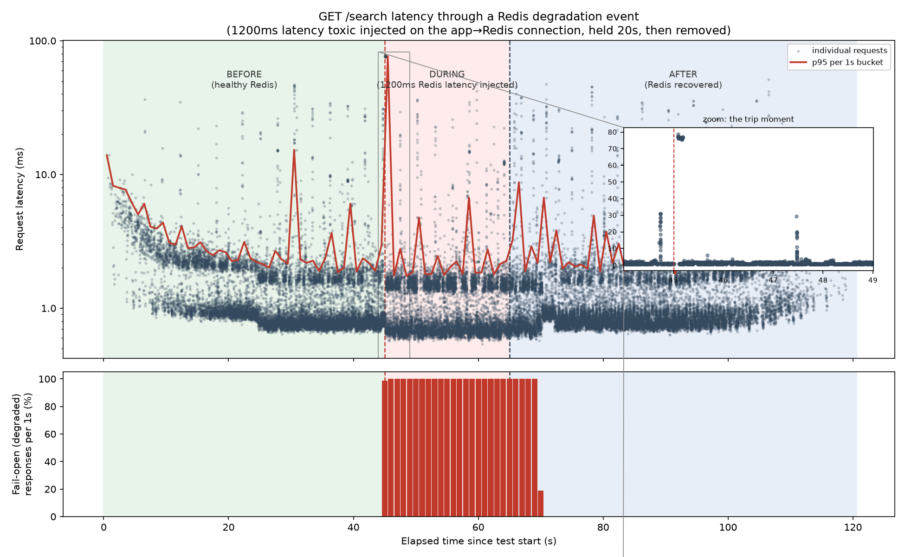
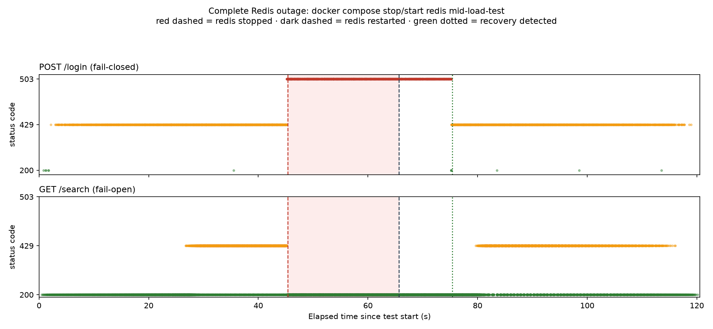

# Distributed Rate Limiter

A rate limiter is easy to write and easy to get wrong twice: once when
multiple processes race to check-and-increment the same counter, and again
when the store backing that counter degrades instead of cleanly failing.
This project proves both problems are actually solved, not just coded
against — 200 truly concurrent requests against a shared limit of 100,
split across three independent application processes, produce *exactly*
100 allowed and 100 denied, every time, across ten separate runs; and when
Redis is made slow (not down) or taken down entirely mid-load-test, the
system degrades according to an explicit, endpoint-specific policy instead
of an accident of whatever the client library happens to do when a socket
hangs.

## 1. What this proves

- **Distributed correctness under real concurrency.** The shared limit is
  enforced in aggregate across replicas that share nothing but Redis, not
  approximately and not "close enough under load" — exactly, verified by
  firing 200 simultaneous requests at a single rate-limit key and counting
  allow/deny outcomes with a zero-tolerance assertion, both against one
  process and against three replicas behind nginx.
- **Deliberate behavior under Redis degradation**, not accidental behavior.
  A circuit breaker with a hard client-side timeout sits in front of every
  Redis call, and each endpoint has an explicit, reasoned fail-open or
  fail-closed policy for what happens when that breaker trips — evidenced
  with real load-test charts, not asserted in prose.

## 2. Architecture

```
                                   ┌──────────────────────────────────────────┐
                                   │              docker compose               │
                                   │                                            │
  clients ──HTTP──▶ nginx :8080 ──┤   ┌────────┐   ┌────────┐   ┌────────┐    │
                    (round robin, │   │  app1  │   │  app2  │   │  app3  │    │
                     no ip_hash)  │   │FastAPI │   │FastAPI │   │FastAPI │    │
                                   │   └───┬────┘   └───┬────┘   └───┬────┘    │
                                   │       │            │            │         │
                                   │       └────────────┼────────────┘         │
                                   │                     │ REDIS_URL            │
                                   │                     ▼                      │
                                   │           ┌───────────────────┐            │
                                   │           │     toxiproxy      │            │
                                   │           │  (test-only fault  │            │
                                   │           │  injection — prod  │            │
                                   │           │  would skip this)  │            │
                                   │           └──────────┬─────────┘            │
                                   │                      ▼                      │
                                   │              ┌───────────────┐              │
                                   │              │     Redis      │              │
                                   │              │  shared limit  │              │
                                   │              │     state      │              │
                                   │              └───────────────┘              │
                                   └──────────────────────────────────────────┘
```

Three named app services rather than `deploy.replicas: 3` — with replicas,
all containers share one Compose-internal DNS name, and nginx's
open-source upstream block resolves hostnames once at startup with no
re-resolution, so it can't reliably enumerate multiple containers behind a
single name for round-robin. Three fixed names give nginx an explicit
three-backend list and make each container's `REPLICA_ID` trivial to set.

Toxiproxy sits only between the app replicas and Redis — nginx and client
traffic never touch it. It exists purely so `/loadtest/degradation.js` and
`/loadtest/outage.js` can inject real network faults on the one connection
that matters for this project's claims; a production deployment would
point `REDIS_URL` straight at Redis.

## 3. Algorithm choice: sliding window counter

Four standard options, and why three of them were rejected:

- **Fixed window counter** — count requests in discrete windows (e.g.
  `[0s, 60s)`, `[60s, 120s)`), reset to zero at each boundary. Rejected:
  it allows up to **2x the intended rate** across a window boundary. A
  client that sends `limit` requests at `t=59s` (end of one window) and
  another `limit` requests at `t=61s` (start of the next) gets `2 × limit`
  requests through in a two-second span, even though the configured rate
  is `limit` per 60 seconds. The counter has no memory of what happened
  just before the boundary.
- **Sliding window log** — store every request's exact timestamp (e.g. in
  a Redis sorted set) and count how many fall within the trailing window.
  Perfectly accurate, but memory cost is O(requests within the window)
  *per key* — a `limit=100` policy means up to 100 stored timestamps per
  client at all times, which doesn't scale cleanly to many keys or high
  limits.
- **Token bucket** — tokens refill at a fixed rate up to a capacity; each
  request spends a token. A reasonable choice when the point is smoothing
  bursts against a steady-state rate, but it answers a different question
  (how large a burst can I absorb right now) than what this project's
  policies actually specify (how many requests in the trailing 60s) — the
  window-count semantics map more directly onto endpoints like `/login`
  where "no more than 5 in a minute" is the actual security requirement.
- **Sliding window counter (chosen)** — approximate the sliding log using
  two fixed-window counters (current + previous), weighting the previous
  window's count by how much of it still falls inside the trailing
  window: `estimated = current + previous × (1 - elapsed_fraction)`
  (`app/limiter/redis_store.py`). This closes the fixed-window boundary
  hole (the previous window's count is still partially counted early in
  the next window) while staying O(1) per key — two integers, not a
  growing timestamp set. It's an estimate, not exact, but close enough for
  this project's purposes and far cheaper than a sliding log.

**Why Lua scripting — not separate `GET`/`INCR` — is what makes the
atomicity claim real.** If the check were `GET current_count` in Python,
compare to the limit, then `INCR`, there's a race window between the read
and the write: two concurrent requests can both read the same
pre-increment count, both decide "under the limit," and both proceed —
even though together they exceed it. Redis executes a single Lua script
as one atomic, uninterruptible operation — no other command, from any
connection, runs while it's executing — so bundling the read, the
comparison, and the increment into one script (`SLIDING_WINDOW_LUA`)
removes that window entirely. This isn't a claim taken on faith: firing
200 truly concurrent requests (via `asyncio.gather`, so they're scheduled
onto the event loop before any of them completes) at a single shared key
with `limit=100` produces **exactly 100 allowed and exactly 100 denied**
— re-verified fresh for this README, 5 consecutive runs against a single
process and 5 more against all three replicas behind nginx:

```
single-instance (tests/test_concurrency.py), 5 runs:
  allowed=100 denied=100   allowed=100 denied=100   allowed=100 denied=100
  allowed=100 denied=100   allowed=100 denied=100

3-replica, via nginx (tests/test_concurrency_distributed.py), 5 runs:
  allowed=100 denied=100  replicas {app1:67 app3:67 app2:66}
  allowed=100 denied=100  replicas {app2:67 app3:67 app1:66}
  allowed=100 denied=100  replicas {app1:67 app3:66 app2:67}
  allowed=100 denied=100  replicas {app3:67 app2:66 app1:67}
  allowed=100 denied=100  replicas {app1:66 app2:67 app3:67}
```

Not "approximately 100" — exactly, ten times, with the load evenly spread
across three independent processes each holding their own Redis
connection. That's the actual distributed-atomicity guarantee: it comes
from Redis serializing script execution, not from anything the
application code does to coordinate.

## 4. The fail-open / fail-closed decision

Every endpoint's policy for "what happens when the breaker is open or the
Redis call times out" is set explicitly per-route in
`app/limiter/policies.py`, not by one global flag:

- **`GET /search` fails open.** If the limiter can't be checked, the
  request is allowed through anyway. A brief false negative here — some
  extra unthrottled reads during a Redis blip — is a minor, recoverable
  cost. Taking a read-only search endpoint fully dark because Redis is
  degraded would be a worse outage than the thing the rate limiter was
  protecting against.
- **`POST /login` fails closed.** If the limiter can't be checked, the
  request is denied with a `503` (not a `429` — this is explicitly *not*
  a rate-limit rejection; the response body carries `"error":
  "limiter_degraded"` to say so). A false negative on login is not a
  minor cost: it silently reopens a brute-force / credential-stuffing
  window for exactly as long as Redis stays degraded. The whole point of
  rate-limiting login is to slow down automated attacks, so quietly
  dropping that protection during an outage would be a security
  regression, not a graceful degradation.

This isn't asserted — it's demonstrated under both a partial degradation
(Redis made slow, not down) and a complete outage:

**Degradation** (`evidence/phase7-degradation/`): a 1200ms latency toxic
injected on the app→Redis connection for 20 seconds, mid-load-test.



The bottom panel is the unambiguous signal: 0% fail-open responses before
injection, ~100% during the toxic window, back to 0% after removal. The
top panel's per-second p95 line shows the real cost of *detecting* the
problem — a single-second spike to ~80ms (the client's own 75ms timeout
being hit by the last few requests before the breaker trips), then an
immediate drop back to ~2ms for the rest of the degraded window, because
the breaker is open and short-circuiting instead of waiting out Redis.

**Complete outage** (`evidence/phase8-outage/`): `docker compose stop
redis` mid-load-test, held ~20s, then restarted.



Out of 45,000 mixed requests: `/search` returned **23,388 × 200, 12,515 ×
429, zero 503s** — it never went down. `/login` returned **12 × 200,
6,104 × 429, and 2,973 × 503** — the 503s are tightly bounded from the
moment Redis stopped (`t=45.3s`) to the moment recovery was detected
(`t=75.4s`), which runs about 10 seconds *longer* than Redis's actual
downtime (it came back at `t≈65.6s`) — the breaker doesn't retry the
instant Redis returns, only once its own 30-second cooldown has elapsed
per replica. That gap is a real, intentional property of the circuit
breaker, not a measurement error.

## 5. Evidence

All raw and derived artifacts live in [`/evidence`](evidence/) (see its
own [README](evidence/README.md) for what's in each subfolder and why the
largest raw k6 outputs — 194MB and 185MB of per-request time series —
aren't committed to git).

**Baseline latency, limiter disabled vs. enabled** (`evidence/phase6-normal-load/`,
0→500 RPS ramp, k6, `GET /search` through nginx):

| Run | p50 | p95 | p99 | 429 rate |
|---|---|---|---|---|
| Disabled #1 | 1.24ms | 2.70ms | 10.83ms | 0% |
| Disabled #2 | 1.29ms | 2.63ms | 8.59ms | 0% |
| Enabled #1 | 0.95ms | 2.74ms | 8.35ms | 78.8% |
| Enabled #2 | 0.82ms | 2.79ms | 10.84ms | 78.7% |

p50/p95 stay within ~0.15ms of each other regardless of whether the
limiter is in the request path — the typical added cost of the Redis
check is negligible, comfortably under the ~5ms target. p99 is noisier:
it swings by 2-4ms between repeated runs of the *identical* configuration,
which is larger than any consistent enabled-vs-disabled difference. That
noise floor comes from this benchmark running k6, Docker Desktop's VM, and
all three app containers plus nginx and Redis on one laptop's CPU — not
from the limiter. Reported as-is rather than picking whichever run number
looks best.

**Concurrency, exact and repeated** — see §3 above for the full 10-run
output; every run: 200 fired, exactly 100 allowed, exactly 100 denied.

**Redis degradation and complete outage** — see §4 above for both charts
and the exact response-code breakdowns.

## 6. What I'd do differently at 100x scale

A single Redis instance is the next bottleneck, not the algorithm or the
application tier. Every rate-limit check on every replica, for every
policy and every key, currently serializes through one Redis process —
that's exactly what makes the atomicity guarantee trivial to reason about
today, but it's also a hard ceiling on throughput once request volume
grows far enough.

The natural next step is Redis Cluster with key-based sharding. Each
check only ever touches two keys for one logical rate-limit decision
(`rl:{policy}:{key}:{window}` and its predecessor), and Redis Cluster
requires all keys touched by a single script invocation to hash to the
same slot — so with a hash tag ensuring both keys for a given
policy+client always land on the same shard, each individual check should
still execute as one atomic script against one node, spreading different
keys' load across the cluster.

The important word there is "should." The atomicity guarantee this
project proves in §3 was verified against a single Redis instance where
one Lua script commits as one atomic unit on one node — that proof does
not automatically transfer to a sharded topology just because the theory
sounds right. Cross-shard behavior, resharding while under load, and
failover mid-script are all things a real Cluster deployment would need
the same kind of concurrency test re-run against, not assumed from this
project's current results.

## 7. How to run it

**Bring up the full stack:**

```bash
docker compose -f infra/docker-compose.yml up -d --build
curl http://localhost:8080/health
```

nginx listens on `localhost:8080` in front of the three app replicas;
Redis and Toxiproxy are internal to the Compose network. `docker compose
-f infra/docker-compose.yml down -v` tears it back down.

**Run the test suite:**

```bash
python3 -m venv .venv && source .venv/bin/activate
pip install -e ".[dev]"
redis-server &                        # most tests need a local Redis on :6379
pytest tests/                         # tests/test_concurrency_distributed.py additionally needs the Compose stack up on :8080
```

**Run the k6 load tests** (`brew install k6`, then `pip install -e
".[loadtest]"` for the chart scripts):

```bash
k6 run loadtest/normal.js                       # baseline, against whatever RATE_LIMITER_ENABLED the stack is running with
python3 loadtest/run_degradation_test.py         # injects a Toxiproxy latency toxic mid-run, then loadtest/chart_degradation.py
python3 loadtest/run_outage_test.py              # stops/restarts the redis container mid-run, then loadtest/chart_outage.py
```
